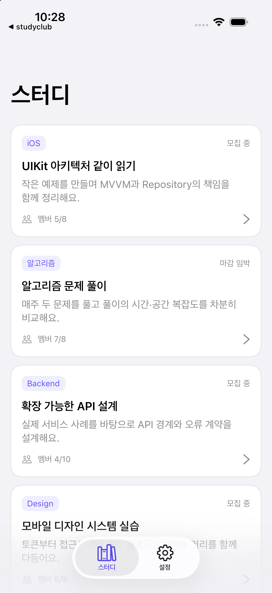
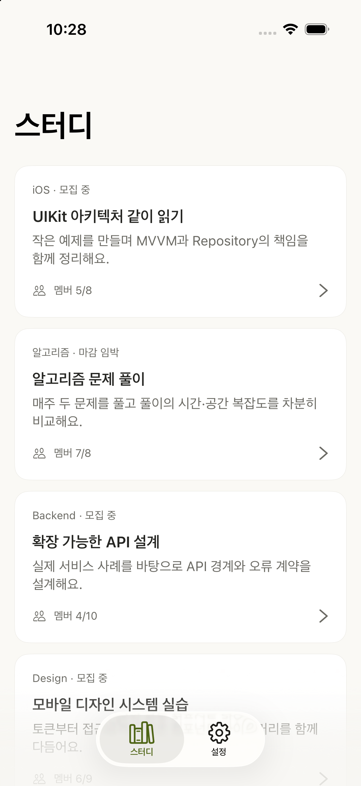
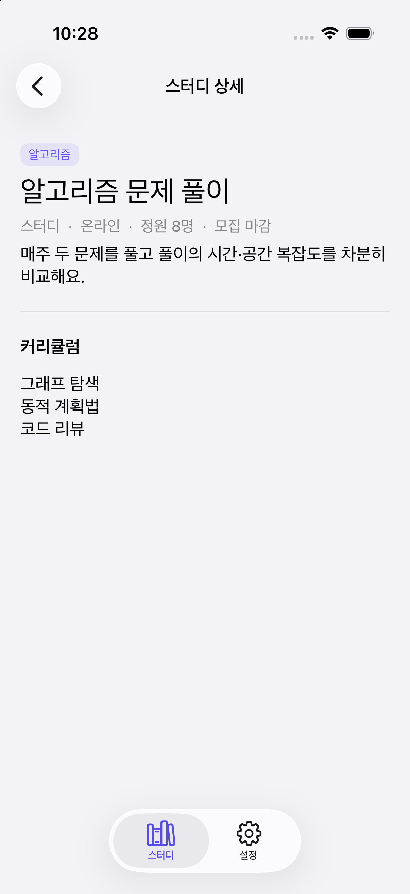
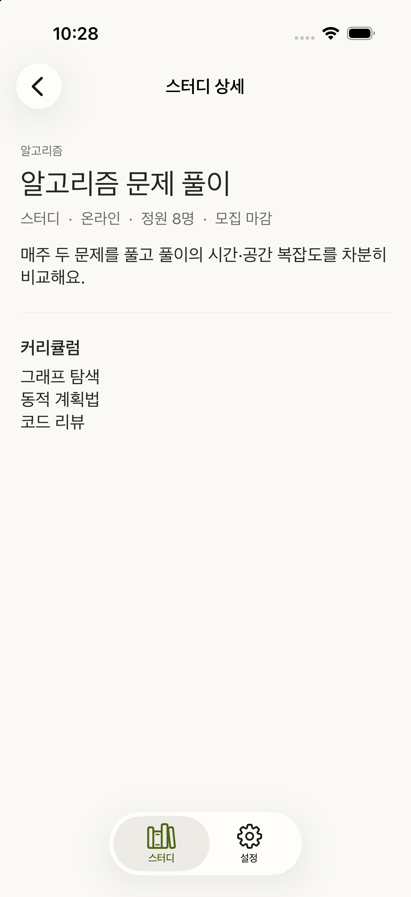
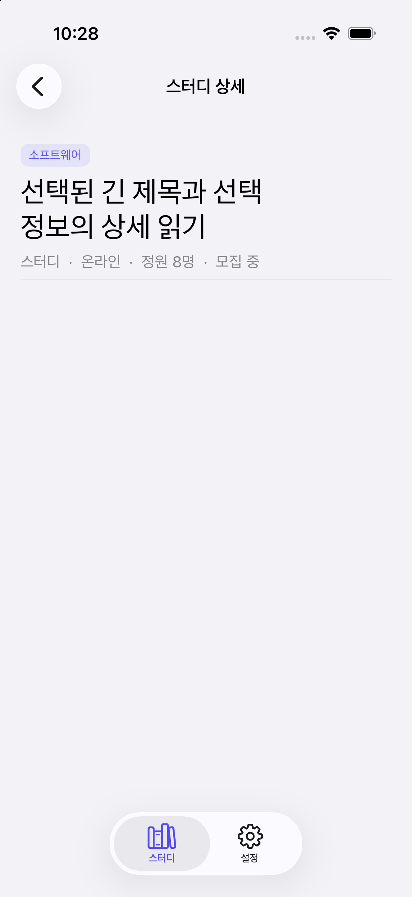
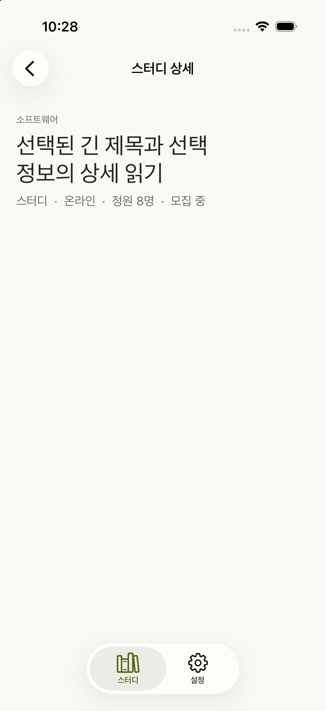
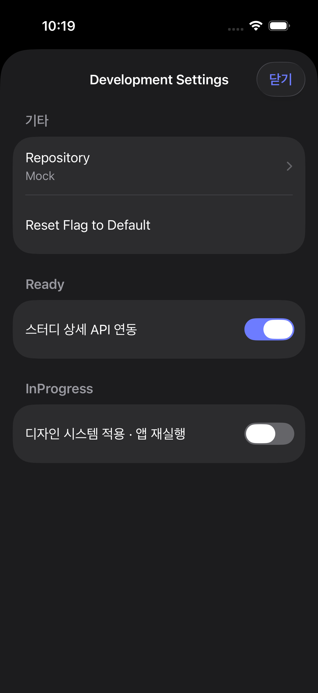
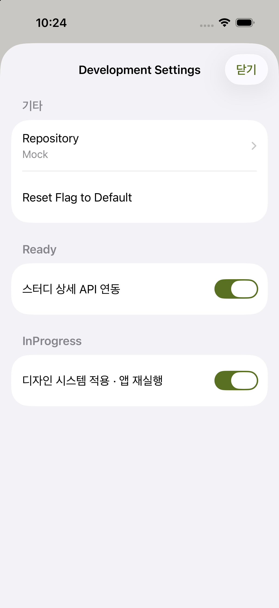

# sc-116 AS-IS / TO-BE 화면 비교

이번 PR의 같은 소스에서 `study.design-system` OFF(AS-IS)와 ON(TO-BE)을 비교했다. OFF는 기준 커밋 `c2fea74614f96210f8b9c01e32a12b389d7e84c9`의 UI를 보존한다. 같은 iPhone 17 Pro / iOS 26.5, 기본 글자 크기, OS 라이트에서 같은 Domain 샘플을 공급해 2026-10-03에 캡처했다.

임시 앱으로 실제 Main/Detail controller와 ViewModel의 기존 Repository 테스트 initializer를 렌더했다. 첫 AppTheme 조회 전에 임시 bundle의 실제 FeatureFlagStore에 ON/OFF를 설정했다. 제품 코드·target에는 비교용 host를 추가하지 않았다. 운영 API 응답, 원래 앱의 화면 이동을 재현한 사진은 아니다. status bar의 OS 이전 앱 링크는 제품 변경에 해당하지 않는다.

| 화면 | AS-IS / OFF | TO-BE / ON |
| --- | --- | --- |
| 목록 |  |  |
| 상세 |  |  |
| 일정·본문·커리큘럼이 없는 상세 |  |  |

목록·상세 일반 표본은 기존 Mock의 제목/소개/멤버/모집 상태를 Domain 값으로 공급했다. 세 번째 표본은 빈 optional 조합을 명시적으로 공급했다. 실제 앱의 toggle/cold launch/Reset 및 Debug/Release 공통 override는 별도 설치 앱에서 관측했고, 아래 두 사진은 그 앱의 기존 Debug 설정 화면이다. OS는 두 사진 모두 dark이며 ON은 app window가 light를 유지한다.

| 실제 Debug 설정 | OFF | ON (cold launch 후) |
| --- | --- | --- |
| InProgress flag |  |  |

앱의 디자인은 process snapshot이므로 toggle/Reset 후 재실행해야 바뀐다. 두 구성 모두 저장 override를 읽고, 없으면 InProgress 기본 OFF다. 설정 UI/변경 기능은 Debug-only다. 이 사진만으로 전체 QA, live API, sc-92 통합 또는 실기기 결과를 주장하지 않는다.
