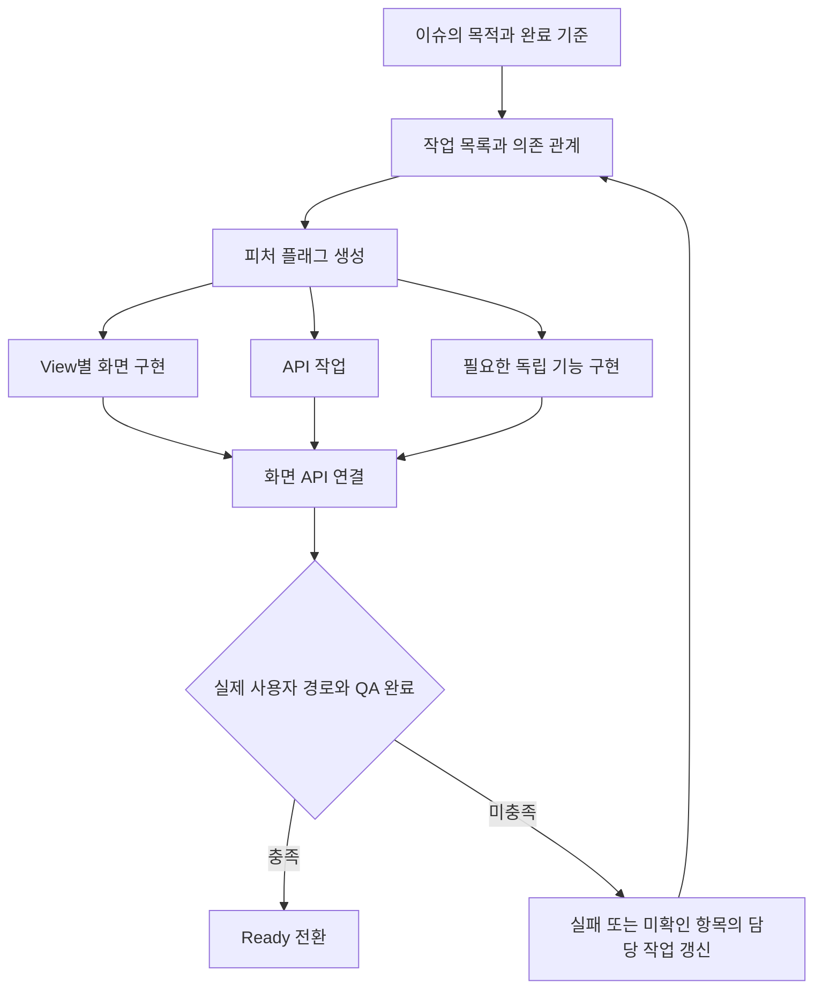

# 이슈·작업·PR 운영 원칙

이슈는 기능의 PRD와 전체 완료 기준을 담는 에픽이다. 구현은 기존 Notion `작업` DB에 등록하고 관계 속성으로 이슈와 연결한다. 작업 하나가 검토할 PR 하나를 맡는다.

전체 PRD는 이슈 본문에 적는다. 작업에는 이번 할 일과 완료 조건을 각각 한 줄 정도로 요약하고 이슈 PRD를 연결한다. 실제 디자인이나 필요한 API·참고 자료가 있을 때만 링크를 추가한다. 의존 관계·브랜치·커밋·PR 규칙과 운영 현황은 공통 운영 문서에서 관리하며 작업마다 반복하지 않는다. 디자인 자료가 없으면 항목과 링크를 생략한다.

## 작업을 나누는 출발점

다음 다섯 단계로 시작한다. 모든 기능을 정확히 다섯 작업이나 고정된 순서로 제한하지 않는다. 실제 화면, 기능, 의존 관계에 맞춰 작업을 추가하고 순서를 정한다.

| 종류 | 작업 제목 예시 | 완료 결과 |
|---|---|---|
| 피처 플래그 생성 | Google 로그인 피처 플래그 생성 | InProgress·기본 OFF로 등록 |
| 화면 구현 | 로그인 View 구현 | 디자인과 하드코딩 데이터로 화면·조작 확인 |
| API 작업 | 인증 API 구현 | 요청·응답·오류 계약과 실제 서버 연결 확인 |
| 기능 구현 | 완료 회원 세션 복원·갱신 기능 구현 | 해당 기능의 동작과 실패 처리 확인 |
| 화면 API 연결 | 로그인 View API 연결 | 실제 데이터와 기능 결과를 화면에 반영 |
| Ready 전환 | Google 로그인 피처 플래그 Ready 전환 | 실제 사용자 경로와 검증을 마친 후보를 기본 ON으로 전환 |

`기능 구현`은 필요할 때 추가하는 작업 종류다. 예를 들어 세션 복원·갱신, 가입 완료 여부 재확인, 검색 조건 저장은 화면을 그리거나 API 응답을 표시하는 작업과 다른 완료 기준을 가질 수 있다. 예시는 작업 분할 기준이며 별도 기능의 제품 범위를 승인한 것은 아니다.

도식은 기본 예시다. API에 의존하지 않는 기능은 앞서 구현할 수 있고, 독립적인 작업은 실제 의존 관계에 맞춰 배치한다. Mermaid 소스 저장과 렌더 확인은 별도로 기록한다.

## 화면과 기능의 분할 기준

- 여러 화면에 걸친 기능은 `로그인 View 구현`, `가입 정보 입력 View 구현`, `설정 계정 영역 View 구현`처럼 화면별 작업으로 나눈다. 하드코딩 데이터 사용 여부는 본문에 적는다.
- API 호출 외에 자체 상태·규칙·저장·실패 처리와 독립된 완료 기준이 있는 기능은 `세션 복원·갱신 기능 구현`처럼 별도 작업으로 나눈다. 화면 API 연결 작업에 모두 넣지 않는다.
- 검토자가 하나의 결과와 검증 범위를 설명할 수 있는 크기로 나눈다. 파일 하나, 함수 하나, 코드 줄 수만으로 작업을 만들지 않는다.
- 분할된 PR은 단독으로 빌드할 수 있어야 한다. 미완성 기능은 플래그로 막고 기존 공개 경로와 필요한 부작용 차단을 유지한다.
- 화면 작업을 나누는 것만으로 새 Router·Coordinator·UseCase·DI 구조를 도입하지 않는다. 기존 아키텍처와 구체적인 필요를 따른다.

## 진행 중 새 작업이 필요한 경우

먼저 발견한 기능의 목적, 범위, 제외 범위, 완료 기준과 의존 관계를 적는다. 기존 이슈의 목적 안에서 필요한 기능이면 기존 `작업` DB에 추가하고 같은 이슈와 연결한다.

기존 작업의 범위를 새 작업으로 옮기면 기존 작업과 새 작업의 설명을 함께 수정한다. 같은 구현이나 검증을 두 작업의 완료 결과로 중복 기록하지 않는다. 선행 작업과 다음 작업의 의존 관계도 갱신한다. 제품 경험·비용·권한·공개 범위가 달라지는 선택은 기존 승인으로 정해졌는지 확인하고, 미결정이면 근거와 대안을 준비해 사용자와 정한다.

외부 OAuth 설정, 서버 계약, 약관 확인처럼 구현 PR을 만들지 않는 선행 확인 작업도 등록할 수 있다. 검증 기록만을 위해 빈 커밋이나 PR을 만들지 않는다.

## 브랜치·커밋·PR

작업 DB가 생성한 실제 ID를 사용한다. 이슈 ID나 GitHub PR 번호를 대신 쓰지 않는다.

- 브랜치: `junsu/sc-{작업 ID}`
- 커밋·PR 제목: `[sc-{작업 ID}] type: 작업 내용`
- PR 본문: 맨 위에 의존 PR 링크, 이어서 작업 링크, 상위 이슈 링크, 완료 범위, 플래그 상태·기본값, 검증 결과와 남은 항목. 화면 구현 PR에는 대표 화면 이미지를 첨부한다.
- 작업 하나에 PR 하나를 만들고 최종 1 PR 1 commit을 지향한다. 검토 중 수정은 최종 커밋에 정리한다.

독립 작업은 최신 원격 main에서 시작한다. 아직 머지되지 않은 선행 작업이 있으면 그 브랜치에서 후속 브랜치를 만든다. 모든 PR의 대상은 main으로 두고 설명 맨 위에 필요한 선행 PR 링크를 적는다. 같은 선행 작업을 공유하는 API·각 View는 병렬로 진행한다. 선행 PR이 미병합인 동안 후속 PR에는 선행 변경도 보일 수 있다. 선행 PR이 main에 반영되면 필요에 따라 후속 브랜치를 갱신해 자기 작업의 변경만 남긴다.

여러 선행 작업을 요구하는 연결 작업은 필요한 결과를 합친 기준에서 시작하고 의존 PR을 모두 연결한다. 선행 작업을 먼저 병합한 뒤 자기 작업의 변경을 검토한다. main에 자동으로 머지하지 않는다.

Google 로그인은 49에서 50·55·56·51을 각각 분기한다. 52는 필요한 View와 API·세션 결과가 준비된 뒤 연결하고, 53은 실제 통합 검증 후 진행한다. 54의 외부 설정 확인은 구현과 병렬로 진행할 수 있다.

작업별 최종 후보를 빌드·검증한다. 이전 통합 후보의 테스트나 화면을 분리된 PR의 검증으로 대체하지 않는다. 브랜치 생성, 로컬 구현, PR 발행, 머지와 작업 완료는 구분해 기록한다.

Ready 전환은 실제 연결과 사용자 경로가 완료됐을 때 별도 작업으로 한다. Mock 성공이나 단위 테스트만으로 실제 인증·서버 연결·UI 검증을 완료 처리하지 않는다. 필요한 외부 설정이나 검증이 남으면 InProgress와 기본 OFF를 유지한다.

## PRD와 작업 설명

ASD-STE100의 명료한 글쓰기 원칙을 한국어에 맞춰 약 80% 적용한다. 목적과 결과를 먼저 쓰고, 한 문장에는 핵심 내용 하나를 담는다. 익숙한 말을 쓰며 같은 개념에는 같은 용어를 쓴다. 자연스러운 한국어와 판단에 필요한 근거를 유지한다. 공식 STE 인증·준수를 뜻하지 않는다.

- PRD는 목적, 사용자 흐름, 기능 범위, 주요 정책과 완료 조건을 적는다. 작은 작업은 변경 범위와 완료 조건만 짧게 적는다.
- 화면의 모든 문구·폰트·간격·UIKit 클래스·서버 필드명까지 PRD에 나열하지 않는다. 디자인·API 계약·코드에서 필요한 세부 내용을 정한다.
- 긴 줄글은 짧은 제목과 항목으로 나눈다. 흐름·상태 분기는 필요할 때 Mermaid로 표현한다.
- Notion에는 실제 제목·목록 블록을 사용한다. 표가 필요하면 실제 표 블록으로 만들고, Markdown의 파이프 문자열이 그대로 남지 않았는지 확인한다.
- 문서를 줄여도 가입 중단·재확인·실패·ON/OFF 같은 제품 결정은 유지한다.
